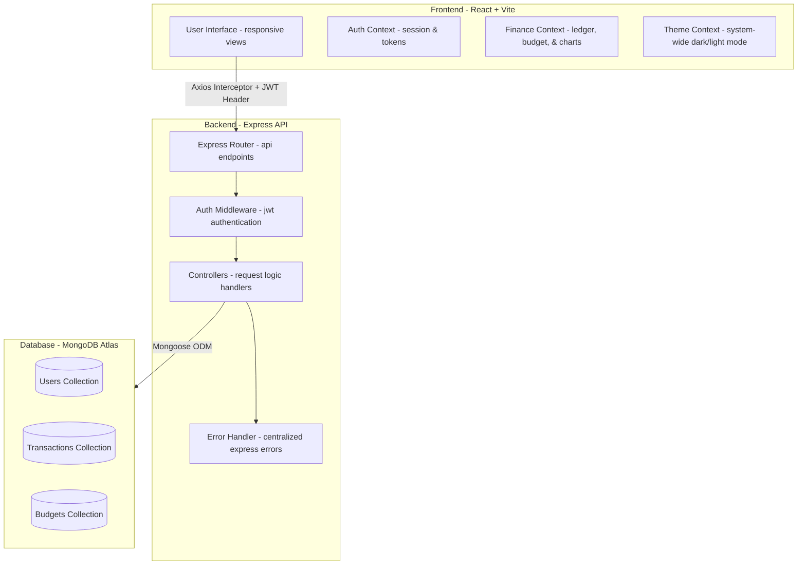
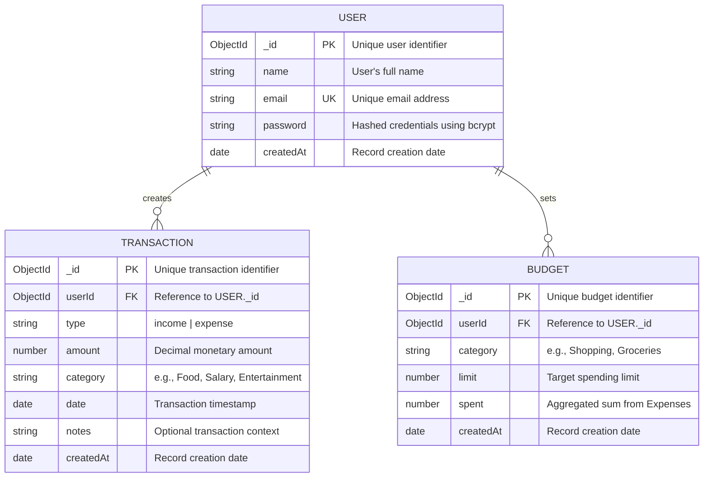

# 🚀 FinTrack Pro — Full-Stack Personal Finance Tracker

FinTrack Pro is a premium, full-stack personal finance tracker designed to help users take control of their financial lives. Built using the MERN stack (MongoDB, Express, React, Node.js) with a custom design system, the app runs smoothly in web browsers (fully responsive) and provides advanced features like real-time simulated stock watchlists, dynamic cash-flow charts, budget trackers, and live currency conversions.

---

## 🏗️ System Architecture

FinTrack Pro follows a classic client-server architecture with state management context layers to secure and cache data on the frontend.



---

## 📊 Entity Relationship (ER) Model

The database schemas are highly structured, referencing users dynamically. Whenever an expense transaction is added, updated, or deleted, database triggers automatically aggregate and synchronize the `spent` status of category budgets.



---

## 🛠️ Tech Stack & Technologies

### Frontend
- **Framework:** React 19 + Vite 8
- **Routing:** React Router Dom v7
- **Styling:** Custom Vanilla CSS Design System with light/dark variables, glassmorphism card panels, and smooth CSS cubic-bezier transitions.
- **Charts:** Chart.js + `react-chartjs-2` (supporting cash flow trends and category-breakdown graphs)
- **Icons:** Lucide React
- **HTTP Client:** Axios with JWT Bearer Interceptors

### Backend
- **Framework:** Node.js + Express 4
- **ORM:** Mongoose (MongoDB Object Modeling)
- **Security:** JWT (JSON Web Tokens), `bcryptjs` (password hashing), CORS configurations
- **Data aggregation:** MongoDB aggregation pipelines for automated budget tracking

---

## 📁 Repository Directory Layout

```
finance-tracker-web/
├── backend/
│   ├── config/              # Database connections (MongoDB)
│   ├── controllers/         # Handler functions for request logic
│   ├── middleware/          # JWT protection, route guards, and error filters
│   ├── models/              # Mongoose data schemas (User, Transaction, Budget)
│   ├── routes/              # Express API route endpoints
│   ├── utils/               # JWT token generators and budget calculations
│   ├── .env                 # Server env config (port, mongo uri, secret)
│   └── index.js             # Main server entry file
│
└── frontend/
    ├── src/
    │   ├── components/      # UI components (Layout, InputField, Dialogs, etc.)
    │   ├── contexts/        # React Context wrappers (Auth, Theme, Finance)
    │   ├── pages/           # 12 functional client views
    │   ├── utils/           # Helper formatters and static category options
    │   ├── App.jsx          # Route paths mapping
    │   ├── main.jsx         # Render entry point
    │   └── index.css        # Global CSS stylesheet (design tokens and UI patterns)
    ├── index.html           # HTML container with SEO headers
    └── .env                 # API endpoints & API keys configuration
```

---

## 📡 REST API Specifications

All endpoints under `/api/transactions` and `/api/budgets` require a valid JWT header (`Authorization: Bearer <token>`).

| Module | Route | HTTP Method | Auth Required | Description |
| :--- | :--- | :---: | :---: | :--- |
| **Auth** | `/api/auth/register` | `POST` | No | Registers a new user account |
| **Auth** | `/api/auth/login` | `POST` | No | Authenticates user & issues JWT token |
| **Auth** | `/api/auth/profile` | `PUT` | Yes | Updates name, email, or passwords |
| **Transactions** | `/api/transactions` | `GET` | Yes | Fetches transactions (filters, pagination) |
| **Transactions** | `/api/transactions` | `POST` | Yes | Adds a new transaction & runs budget sync |
| **Transactions** | `/api/transactions/:id` | `PUT` | Yes | Modifies a transaction & updates budgets |
| **Transactions** | `/api/transactions/:id` | `DELETE` | Yes | Deletes a transaction & updates budgets |
| **Budgets** | `/api/budgets` | `GET` | Yes | Returns all active category budgets |
| **Budgets** | `/api/budgets` | `POST` | Yes | Configures a new target category budget |
| **Budgets** | `/api/budgets/:id` | `PUT` | Yes | Alters budget category or spending limit |
| **Budgets** | `/api/budgets/:id` | `DELETE` | Yes | Removes category budget |

---

## ⚙️ Environment Configurations

### 1. Backend (`/backend/.env`)
Create a file at `/backend/.env`:
```env
PORT=5000
MONGO_URI=mongodb+srv://<username>:<password>@cluster.mongodb.net/fintrack
JWT_SECRET=your_super_secure_jwt_secret_token_key_here
NODE_ENV=development
```

### 2. Frontend (`/frontend/.env`)
Create a file at `/frontend/.env`:
```env
VITE_API_BASE_URL=http://localhost:5000/api
VITE_EXCHANGE_RATE_API_KEY=your_optional_exchangerate_api_key
```

---

## 🚀 Installation & Running Locally

### Step 1: Clone and install backend dependencies
```bash
cd backend
npm install
```

### Step 2: Install frontend dependencies
```bash
cd ../frontend
npm install
```

### Step 3: Run the servers

1. **Start Backend Server:**
   ```bash
   cd backend
   npm run dev
   ```
   The API will listen at `http://localhost:5000`.

2. **Start Frontend Server:**
   ```bash
   cd frontend
   npm run dev
   ```
   The client application will launch locally (normally at `http://localhost:5173` or `http://localhost:5174`). Open it in your web browser.

---

## 🛡️ Security Best Practices Included
- **Credentials Encryption:** Passwords are encrypted in the MongoDB instance using `bcryptjs` hashing.
- **Route Guarding:** Frontend pages are wrapped in a `<ProtectedRoute>` component that automatically redirects unauthenticated sessions to the Login page.
- **Git Safety:** Both `.gitignore` files are pre-configured to keep local database configs, logs, keys, and `.env` credentials safely excluded from version control.
